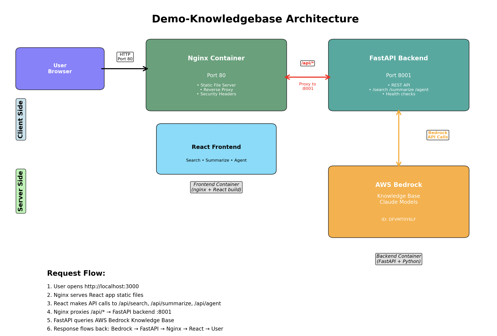

# Knowledge Base Explorer - Full Stack Application

A modern web application for searching and summarizing content from Amazon Bedrock Knowledge Bases. Built with React frontend and FastAPI backend, containerized for easy deployment.

## 🏗️ Architecture

```
┌─────────────────┐    ┌─────────────────┐    ┌─────────────────┐
│   React Frontend │    │  FastAPI Backend │    │ Amazon Bedrock  │
│   (Port 3000)    │◄──►│   (Port 8000)    │◄──►│ Knowledge Base  │
│                 │    │                 │    │                 │
│ • Search UI     │    │ • REST API      │    │ • Vector Search │
│ • Summarize UI  │    │ • AWS SDK       │    │ • AI Generation │
│ • Results View  │    │ • Error Handling│    │ • Citations     │
└─────────────────┘    └─────────────────┘    └─────────────────┘
```

## 📐 Detailed Architecture



The diagram above shows the detailed architecture and request flow between components:
- Frontend React application served on port 3000
- NGINX reverse proxy handling routing and static file serving
- FastAPI backend service running on port 8000
- AWS Bedrock service integration for knowledge base operations


## 🚀 Features

### Frontend (React + TypeScript)
- **🔍 Search Interface**: Vector similarity search with relevance scores
- **📚 Summarize Interface**: AI-powered summaries with source citations
- **📊 Results Display**: Rich formatting with metadata and source links
- **⚡ Real-time Status**: Health monitoring and connection status
- **🎨 Modern UI**: Tailwind CSS with responsive design
- **🔄 Loading States**: Smooth UX with loading indicators

### Backend (FastAPI + Python)
- **🌐 REST API**: Clean endpoints for search and summarization
- **🔐 AWS Integration**: Secure Bedrock client with credential management
- **📝 Data Validation**: Pydantic models for request/response validation
- **🚨 Error Handling**: Comprehensive error responses
- **📊 Health Checks**: Service monitoring endpoints
- **📖 Auto Documentation**: OpenAPI/Swagger docs

## 📋 Prerequisites

1. **AWS Account** with Bedrock access
2. **Knowledge Base** created in Amazon Bedrock
3. **Docker & Docker Compose** installed
4. **AWS Credentials** configured

## 🛠️ Quick Start

### 1. Clone and Setup
```bash
cd api_docker/demo-knowledgebase
cp env.example .env
# Edit .env with your AWS credentials and knowledge base ID
```

### 2. Configure Environment
Edit `.env` file:
```bash
# Required
AWS_REGION=us-west-2
KNOWLEDGE_BASE_ID=your-knowledge-base-id
AWS_ACCESS_KEY_ID=your-access-key
AWS_SECRET_ACCESS_KEY=your-secret-key

# Optional
MODEL_ARN=arn:aws:bedrock:us-west-2::foundation-model/anthropic.claude-3-sonnet-20240229-v1:0
```

### 3. Start Application
```bash
# Build and start all services
docker-compose up --build

# Or run in background
docker-compose up -d --build
```

### 4. Access Application
- **Frontend**: http://localhost:3000
- **Backend API**: http://localhost:8000
- **API Docs**: http://localhost:8000/docs

## 🔧 Development Setup

### Backend Development
```bash
cd backend
pip install -r requirements.txt
python main.py
```

### Frontend Development
```bash
cd frontend
npm install
npm start
```

## 📡 API Endpoints

### Health Check
```http
GET /health
```
Returns service status and configuration.

### Search Knowledge Base
```http
POST /search
Content-Type: application/json

{
  "query": "your search query",
  "max_results": 5,
  "knowledge_base_id": "optional-override"
}
```

### AI Summarization
```http
POST /summarize
Content-Type: application/json

{
  "query": "your question",
  "max_results": 5,
  "knowledge_base_id": "optional-override",
  "model_arn": "optional-model-override"
}
```

### List Knowledge Bases
```http
GET /knowledge-bases
```

## 🐳 Docker Configuration

### Backend Dockerfile
- **Base**: Python 3.11 slim
- **Security**: Non-root user
- **Health**: Built-in health checks
- **Optimization**: Multi-layer caching

### Frontend Dockerfile
- **Build Stage**: Node.js 18 Alpine
- **Production**: Nginx Alpine
- **Features**: Gzip, security headers, API proxy
- **Optimization**: Multi-stage build

### Docker Compose Features
- **Networking**: Isolated bridge network
- **Health Checks**: Service dependency management
- **Volumes**: AWS credentials mounting
- **Environment**: Flexible configuration

## 🚀 Deployment Options

### Local Development
```bash
docker-compose up --build
```

### Production Deployment
```bash
# Build for production
docker-compose -f docker-compose.yml -f docker-compose.prod.yml up -d

# Or use individual images
docker build -t kb-backend ./backend
docker build -t kb-frontend ./frontend
```

### Kubernetes (EKS) Deployment

#### 1. Build and Push Images
```bash
# Build images
docker build -t your-registry/kb-backend:latest ./backend
docker build -t your-registry/kb-frontend:latest ./frontend

# Push to registry
docker push your-registry/kb-backend:latest
docker push your-registry/kb-frontend:latest
```

#### 2. Create Kubernetes Manifests
```yaml
# backend-deployment.yaml
apiVersion: apps/v1
kind: Deployment
metadata:
  name: kb-backend
spec:
  replicas: 3
  selector:
    matchLabels:
      app: kb-backend
  template:
    metadata:
      labels:
        app: kb-backend
    spec:
      containers:
      - name: backend
        image: your-registry/kb-backend:latest
        ports:
        - containerPort: 8000
        env:
        - name: AWS_REGION
          value: "us-west-2"
        - name: KNOWLEDGE_BASE_ID
          valueFrom:
            secretKeyRef:
              name: aws-secrets
              key: knowledge-base-id
        resources:
          requests:
            memory: "256Mi"
            cpu: "250m"
          limits:
            memory: "512Mi"
            cpu: "500m"
```

#### 3. Deploy to EKS
```bash
kubectl apply -f k8s/
kubectl get pods
kubectl get services
```

## 🔒 Security Considerations

### AWS Credentials
- **IAM Roles**: Use EKS service accounts with IAM roles (recommended)
- **Secrets**: Store credentials in Kubernetes secrets
- **Least Privilege**: Grant minimal required permissions

### Required IAM Permissions
```json
{
  "Version": "2012-10-17",
  "Statement": [
    {
      "Effect": "Allow",
      "Action": [
        "bedrock:ListKnowledgeBases",
        "bedrock:GetKnowledgeBase",
        "bedrock:Retrieve",
        "bedrock:RetrieveAndGenerate"
      ],
      "Resource": "*"
    }
  ]
}
```

### Network Security
- **CORS**: Configure for production domains
- **HTTPS**: Use TLS in production
- **Firewall**: Restrict access to necessary ports

## 📊 Monitoring & Logging

### Health Checks
- **Backend**: `/health` endpoint
- **Frontend**: `/health` endpoint
- **Docker**: Built-in health checks

### Logging
```bash
# View logs
docker-compose logs -f backend
docker-compose logs -f frontend

# In Kubernetes
kubectl logs -f deployment/kb-backend
kubectl logs -f deployment/kb-frontend
```

### Metrics
- **Backend**: FastAPI metrics available
- **Frontend**: Nginx access logs
- **AWS**: CloudWatch integration possible

## 🐛 Troubleshooting

### Common Issues

#### 1. AWS Credentials
```bash
# Test credentials
docker-compose exec backend python -c "import boto3; print(boto3.Session().get_credentials())"
```

#### 2. Knowledge Base Access
```bash
# Validate setup
docker-compose exec backend python validate_setup.py
```

#### 3. Network Issues
```bash
# Check connectivity
docker-compose exec frontend curl http://backend:8000/health
```

#### 4. Build Issues
```bash
# Clean rebuild
docker-compose down
docker system prune -f
docker-compose up --build --force-recreate
```

### Debug Mode
```bash
# Enable debug logging
export LOG_LEVEL=DEBUG
docker-compose up
```

## 🔄 Updates & Maintenance

### Update Dependencies
```bash
# Backend
cd backend && pip-compile requirements.in

# Frontend
cd frontend && npm update
```

### Database Migrations
Not applicable - stateless application.

### Backup Considerations
- **Configuration**: Backup environment files
- **AWS Resources**: Knowledge base configuration
- **No persistent data**: Application is stateless

## 📈 Performance Optimization

### Backend
- **Connection Pooling**: AWS SDK handles this
- **Caching**: Consider Redis for frequent queries
- **Async**: FastAPI async endpoints

### Frontend
- **Code Splitting**: React lazy loading
- **Caching**: Nginx static asset caching
- **CDN**: Consider CloudFront for production

### Infrastructure
- **Auto Scaling**: EKS horizontal pod autoscaler
- **Load Balancing**: Application Load Balancer
- **Monitoring**: CloudWatch, Prometheus

## 📝 API Documentation

Full API documentation is available at:
- **Swagger UI**: http://localhost:8000/docs
- **ReDoc**: http://localhost:8000/redoc
- **OpenAPI JSON**: http://localhost:8000/openapi.json

## 🤝 Contributing

1. Fork the repository
2. Create feature branch
3. Make changes
4. Test locally with Docker Compose
5. Submit pull request

## 📄 License

This project is provided as-is for educational and development purposes. 